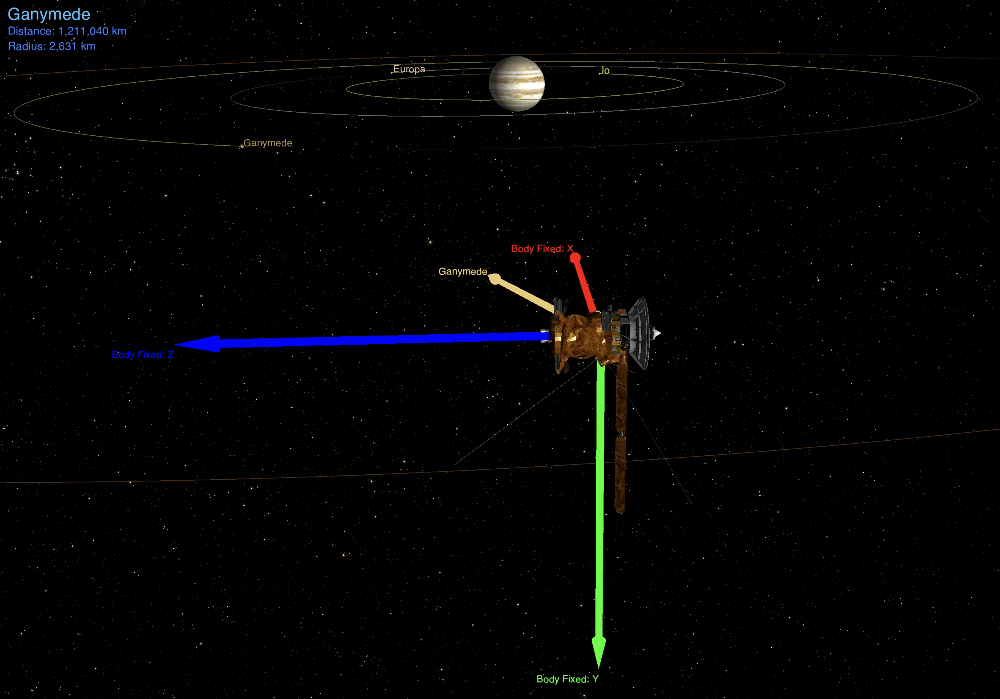

# cosmo-demos | SPICE-Enhanced Cosmographia Tutorials
## Nabla Zero Labs, 2021

This is `cosmo-demos`, a software utility for creating advanced astrodynamics visualizations using NASA's SPICE-Enhanced Cosmographia.




## Dependencies
* [SPICE-Enhanced Cosmographia 4.0](https://naif.jpl.nasa.gov/naif/cosmographia.html)

# Cosmographia
SPICE-enhanced Cosmographia is an open source visualization tool used to
produce 3D animations of planets (3D models and orbits), stars, and spacecraft
(trajectories, 3D models, sensor FOVs, etc.). This repository interacts with
Cosmographia via Python scripts, SPICE kernels, JSON catalogs, and CAD models.

# Getting Started
This repository is accompanied by YouTube videos that explain how to run the existing scenes and create scenes from scratch.
* [Cosmographia Tutorials Video Series](https://www.youtube.com/playlist?list=PLinlYN8Y2w8dF_FI2baI5YXM476_7kekz)

## Setting Environment Variables
`cosmo-demos` calls Cosmographia via bash scripts that point to the Cosmographia executable, JSON catalogs, SPICE kernels, and Python scripts. In order to use this repository, one must set 2 environment variables: `COSMOGRAPHIA` and `COSMO_DEMOS`.

This is done via the `export` command, which for convenience can be placed in a .bash_profile or .bashrc file. For example:

```sh
$ export COSMOGRAPHIA=${HOME}/cosmographia-4.0/Cosmographia.app/Contents/MacOS/Cosmographia
$ export COSMO_DEMOS=${HOME}/cosmo-demos/scenes
```

* [Video explaining how to set these environment variables](https://youtu.be/OU6bOjYOVus)

Once the environment variables are set, one can call any bash script that corresponds to a scene in this repository. For example (from the base of the repository):

```sh
$ ./scenes/ct003_py_json_spice/run_sun_synchronous_orbit.sh
```

# Manually Setting Camera Views
The following is a "cheat sheet" of how to use the keyboard and mouse to maneuver the camera position and orientation manually.

* **Circle around central body** - Hold left click and move mouse
* **Rotate camera orientation only (no translation)** - Hold right click and move mouse
* **Move camera forward** - Scroll up
* **Move camera backward** - Scroll down
* **Rotate camera clockwise** - Right arrow
* **Rotate camera counterclockwise** - Left arrow
* **Go to object** - Left double click

## Plugging in Desired View to Scene Python Scripts
Once the desired view is achieved by manually moving the camera, the
position and orientation values can be extracted and passed into a Python
script to set the initial view of a scene. Here are the steps:

1. Click on File --> Copy State URL to Clipboard (Command+u on MacOS)
2. Pass in URL to the parse_cosmo_url.py script
```sh
$ python3 src/parse_cosmo_url.py "[paste URL here inside of double quotes]"
```
3. Copy and paste the printed setCameraPosition and setCameraOrientation commands to the scene Python script. The following is an example output:
```py
cosmo.setCameraPosition( [ -52536.063013, -29446.819564, -8254.010454 ] )
cosmo.setCameraOrientation( [ 0.452261, 0.731298, -0.286255, -0.422755 ] )
```

For convenience, the following bash function can be placed in a .bash_profile or .bashrc after the `COSMO_DEMOS` environment variable definition to more easily call the parse_cosmo_url script:

```sh
parse_cosmo_url() {
        python3 ${COSMO_DEMOS}/../src/parse_cosmo_url.py "$1";
}
```

This way, one can parse the Cosmographia URL without considering relative paths to the Python script. The following is how to call the bash function (parse_cosmo_url can be tab autocompleted in the terminal):

```sh
$ parse_cosmo_url "[paste URL here inside of double quotes]"
```

[Video with example of setting camera view and using URL parser](https://youtu.be/Lf2kb96J5uA)
